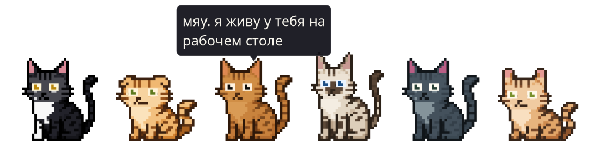

<p align="center">
  
</p>

<h1 align="center">Мяумори для Linux</h1>

<p align="center">
  Пиксельный кот, который живёт на рабочем столе KDE: ходит поверх окон,<br>
  комментирует происходящее, слушает голос и спит в лежанке на панели.
</p>

<p align="center">
  
  
  
  
</p>

Порт идеи macOS-приложения Mewmori. От оригинала взята только графика, весь код
написан заново. Всё работает локально: модель крутится в ollama на твоей машине,
распознавание речи тоже.

## Что умеет

| | |
|---|---|
| **Живёт на столе** | Прозрачное окно поверх всех окон, 6 скинов, два десятка аксессуаров, анимации по костям. Можно таскать мышкой и уложить спать в лежанку на панели. |
| **Замечает** | Активное окно, вкладки Firefox, уведомления, музыку, нагрузку на железо, сессии Claude Code, удалённые машины по SSH. Может взглянуть на экран и прокомментировать. |
| **Помнит** | Ведёт дневник дня, собирает факты о хозяине и возвращается к ним в разговоре. |
| **Слушает** | Диктовка в любое поле, голосовые команды, вопрос вслух, отклик на имя. Whisper локально, на GPU если он есть. |
| **Помогает** | Напоминания («в 15 часов выпить таблетку»), карточки слов с интервальным повторением (FSRS) и выгрузкой в Anki, учёт экранного времени, напоминание о перерыве. |
| **Пишет в Telegram** | «Ответь такому-то, что…»: находит адресата, составляет черновик, отправляет только после подтверждения. |
| **Не мешает** | Замолкает, когда машина занята сборкой, и уступает видеопамять игре на весь экран. |

## Установка

Нужны KDE Plasma 6 на X11, Python 3.13+ и [ollama](https://ollama.com) с любой
моделью.

```bash
sudo apt install python3-gi python3-gi-cairo xdotool
git clone https://github.com/artemspt/mewmori-linux.git
cd mewmori-linux
./run.sh
```

Этого достаточно: кот запускается, рисует, говорит и всё замечает. Сторонних
Python-пакетов для этого нет, только системные `gi` и `cairo`.

**Лежанка на панель:**

```bash
./plasmoid/install.sh
```

Потом добавь виджет «Mewmori Bed» на панель. `./run.sh --bed` запускает кота сразу
спящим в ней.

**Голос и Telegram** (по желанию):

```bash
python3 -m venv --system-site-packages .venv
.venv/bin/pip install -r requirements.txt
```

`--system-site-packages` обязателен: PyGObject приходит из дистрибутива, и
закрытый virtualenv его не увидит. Если какого-то пакета нет, кот работает как
прежде, а недостающая часть сама говорит, чего ей не хватает.

## Клавиши

| Клавиша | Что делает |
|---|---|
| Правый `Alt` (держать) | Диктовка в активное поле |
| `Shift` + `Ctrl` (держать) | Голосовая команда: «открой терминал», «следующий трек» |
| `F1` (держать) | Спросить кота вслух |
| `F1` (коротко) | Окошко, чтобы написать коту |
| «Мяумори», «кот» | Позвать по имени без клавиш |

Все клавиши, скин, модель и то, за чем кот следит, меняются в настройках
(правый клик по коту). Они лежат в `~/.config/mewmori/settings.json`.

## Как устроено

```
┌──────────────────────┐    D-Bus     ┌─────────────────────┐
│ Кот (GTK3, Python)   │◄────────────►│ Лежанка (QML)       │
│ окно поверх всех     │              │ виджет панели KDE   │
└──────────┬───────────┘              └─────────────────────┘
           │ HTTP 127.0.0.1:11434
           ▼
┌──────────────────────┐
│ ollama               │  одна модель на всё
└──────────────────────┘
```

Подробно, с причинами каждого решения и граблями по дороге:
[ARCHITECTURE.md](ARCHITECTURE.md).

Проверки без дисплея и без модели:

```bash
python3 test_rig.py
```

## Приватность

Данные кота (дневник, память, сессия Telegram) лежат в `~/.config/mewmori` и
`~/.local/share/mewmori` и никуда не уходят. Набранный текст, похожий на пароль
или токен, в дневник не попадает.

## Благодарности

Идея и графика: оригинальное приложение Mewmori для macOS. Шрифты Handjet и
Pixellari распространяются по лицензии OFL.
